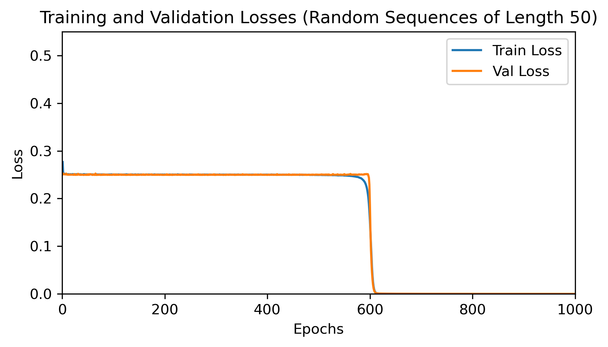
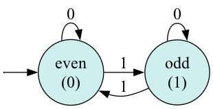
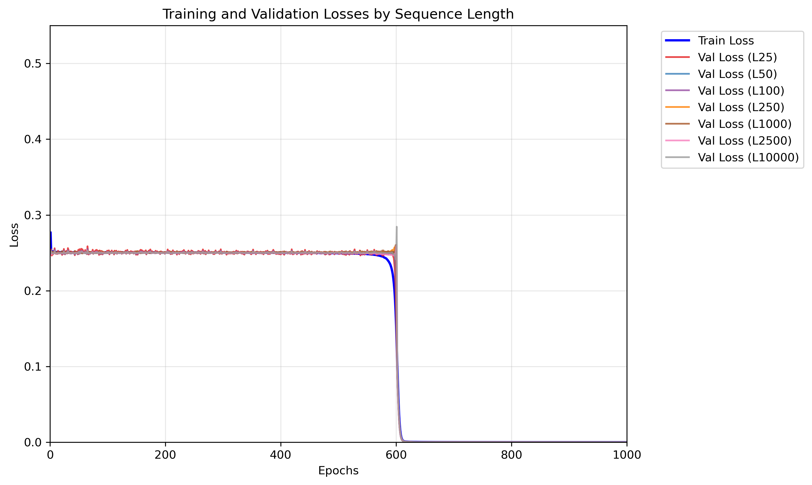
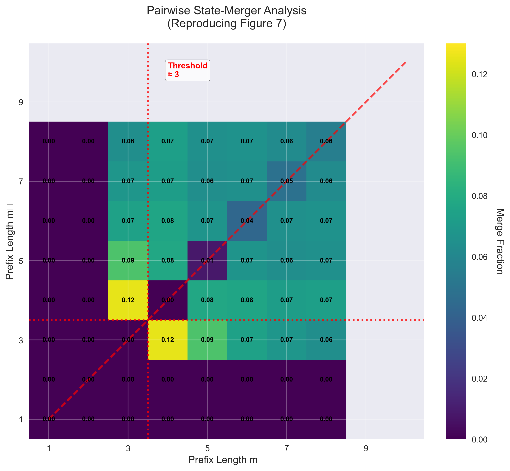

# Replicating _Algorithm Development in Neural Networks: Insights from the Streaming Parity Task_ by Loek van Rossem, Andrew M. Saxe

### By Ignazio Perez Romero | igp4@cornell.edu | https://github.com/ignaziopr

## Purpose

This project reproduces the key empirical findings from _Algorithm Development in Neural Networks: Insights from the Streaming Parity Task_: https://openreview.net/forum?id=3go0lhfxd0

### Key Contributions Replicated

1. **Phase Transition to Perfect Generalization**: RNNs trained on short sequences (length 1-10) exhibit a sharp transition from random performance to 100% accuracy on arbitrarily long sequences around epoch 600-700.

2. **Algorithmic Learning via State Merger**: The network learns by merging hidden states that correspond to equivalent computational states, effectively constructing a finite automaton internally.

3. **Pairwise State-Merger Analysis**: Prefix pairs that "agree" on future continuations merge their hidden representations during training, with a threshold behavior at minimum prefix length ≈ 3.

4. **Finite Automaton Extraction**: The trained network's hidden states can be clustered and minimized to recover the theoretical 2-state parity automaton, proving algorithmic learning occurred.

### Research Significance

This work provides crucial insights into how neural networks can transcend pattern memorization to develop genuine computational algorithms. The streaming parity task serves as an ideal testbed because:

- It requires maintaining state across arbitrary sequence lengths
- The optimal solution is a simple 2-state finite automaton
- Generalization can be tested rigorously on sequences far beyond training distribution

This replication validates that neural networks can achieve infinite generalization through implicit algorithmic development, with direct implications for understanding AI capabilities and limitations.

## Figures

### Figure 1



### Figure 2



### Figure 6



### Figure 7



## Setup

1. **Clone this repository**

   ```bash
   git clone <repo_url>
   cd streaming_parity_replication
   ```

2. **Create & activate a Conda environment**

   This project uses a Python virtual environment called `parity-rnn-state-merge`.

   ```bash
   python -m venv parity-rnn-state-merge
   ```

   To activate the virtual environment:

   **On macOS/Linux:**

   ```bash
   source parity-rnn-state-merge/bin/activate
   ```

   **On Windows:**

   ```bash
   parity-rnn-state-merge\Scripts\activate
   ```

   After activation, your terminal prompt should show `(parity-rnn-state-merge)` at the beginning.

   ```bash
   which python  # Should point to the venv Python (macOS/Linux)
   where python  # Should point to the venv Python (Windows)
   ```

   Install project dependencies:

   ```bash
   pip install --upgrade pip
   pip install -r requirements.txt
   ```

   Alternative manual installation:

   ```bash
   pip install torch torchvision torchaudio
   pip install numpy matplotlib seaborn pandas
   pip install scikit-learn graphviz
   pip install jupyter notebook
   ```

   Deactivating the Environment:

   ```bash
   deactivate
   ```

## Data Creation

1. Overview
   The `data_production.ipynb` notebook generates training and validation datasets for the streaming parity task, where networks must output 0 for even parity (even number of 1s) and 1 for odd parity.

   ### The Streaming Parity Task

   - **Input**: Binary sequences of varying lengths (e.g., [1, 0, 1, 1, 0])
   - **Output**: 0 if even number of 1s, 1 if odd number of 1s
   - **Challenge**: Networks must generalize to sequences thousands of times longer than training data

   This task tests whether networks learn the underlying algorithm versus memorizing patterns.

2. Data Collection Strategy

   Training Data

   - **All possible binary sequences** from length 1 to 10
   - Total: 2¹ + 2² + ... + 2¹⁰ = 2,046 sequences
   - Exhaustive coverage ensures complete learning foundation

   Validation Data

   - **100 random sequences** at each length: 25, 50, 100, 250, 1000, 2500, 10000
   - Tests generalization to sequences much longer than training (max training = 10)
   - Fixed random seed (0) for reproducibility

3. Running

   Execute all cells in `src/data_production.ipynb`

4. Output & Format

   - `../data/training/train_data.npz`: All 2,046 training sequences
   - `../data/validation/val_data_{length}.npz`: 100 validation sequences per target length
   - **Sequences**: Arrays of 0s and 1s
   - **Labels**: Arrays (0=even, 1=odd parity)
   - **Storage**: Compressed `.npz` format

5. Importance for Replication
   A. **Complete training set**: Uses ALL short sequences (not random sampling)
   B. **Specific validation lengths**: Tests different aspects of generalization
   C. **Reproducible randomness**: Fixed seed ensures consistent results
   D. **Algorithm vs. memorization**: Design specifically tests whether networks learn the parity algorithm

## RNN Architecture & Training

1. Architecture Overview

   The ParityRNN model implements a simple recurrent neural network designed to learn the streaming parity algorithm. The architecture closely follows the paper's specifications with minor optimizations for training stability.

   **Model Components**
   RNN Layer: Single fully connected recurrent layer with 100 hidden ReLU units
   Readout Layer: Linear layer mapping hidden states to 2-dimensional output (even/odd parity)
   Input: 2-dimensional one-hot encoding (for bits 0 and 1)
   Output: 2-dimensional logits (converted to probabilities via softmax)

   **Key Architecture Details**
   pythonclass ParityRNN(nn.Module):
   def **init**(self, input_size=2, hidden_size=100, output_size=2):
   self.rnn = nn.RNN(input_size, hidden_size, nonlinearity='relu', batch_first=True)
   self.readout = nn.Linear(hidden_size, output_size)

2. Differences from Paper

   While the core architecture matches Appendix C.1, several modifications were made for training stability:
   Xavier Initialization: Gain set to 0.99 instead of 0.1 (paper's original)
   Learning Rate: 0.05 instead of 0.02 (higher for faster convergence)
   Gradient Clipping: Added clip*grad_value*(0.5) to prevent exploding gradients
   Adaptive Batch Sizes: Variable validation batch sizes based on sequence length

3. Training Configuration

   Hyperparameters
   hidden_size = 100 # Hidden ReLU units
   input_size = 2 # One-hot binary input
   output_size = 2 # One-hot parity output  
   learning_rate = 0.05 # SGD learning rate
   batch_size = 128 # Training batch size
   num_epochs = 1000 # Training epochs
   optimizer = SGD(momentum=0.0, weight_decay=0.0)
   criterion = MSELoss() # Mean squared error loss

4. Training Challenges and Solutions

   Vanishing Gradients
   Problem: Original paper's Xavier gain (0.1) caused vanishing gradients, preventing learning.
   Solution: Increased initialization gain to 0.99 while maintaining small weights for the merger effect.
   Training Instability
   Problem: Large gradients during early training caused instability.
   Solution: Added gradient clipping (clip_value=0.5) to stabilize training.
   Memory Efficiency
   Problem: Long validation sequences (up to 10,000 tokens) caused memory issues.
   Solution: Implemented adaptive batch sizes: Length ≤25: batch_size=100, Length ≤50: batch_size=50,Length >50: batch_size=25

5. Training Results

   The model demonstrates the paper's key finding - a sharp phase transition from random performance to perfect generalization:

   Epochs 1-500: Random performance (~50% accuracy, loss ~0.25)
   Epoch ~600: Sudden transition begins
   Epochs 700+: Perfect performance (100% accuracy, loss ~0.0001)

6. How to Run Training

   Execute all cells in `src/train_parity_rnn.ipynb`

## Hidden State Extraction and DFA Construction

1. Overview

   The `extract_hidden_states.ipynb` notebook implements the paper's core methodology for analyzing how RNNs develop algorithms through implicit state merger. It extracts hidden states from a trained Parity RNN and constructs a Deterministic Finite Automaton (DFA) representing the learned algorithm.

2. Purpose

   Reveals whether the network learned the underlying parity algorithm by:

   - Extracting discrete states from continuous hidden representations
   - Building a finite automaton from internal network dynamics
   - Verifying if the extracted DFA matches the theoretical 2-state parity automaton

3. Key Steps

   A. Load Trained Model & Data

   Loads the trained RNN and validation sequences (length 50) for analysis.

   B. Extract Hidden State Trajectories

   ```python
   # Collect hidden states at each timestep
   out, _ = model.rnn(x.unsqueeze(0))
   h_seq = out.squeeze(0).cpu().numpy()
   ```

   Captures hidden state evolution throughout each validation sequence.

   C. Cluster Hidden States

   ```python
   # PCA reduction: 100D → 7D (92% variance retained)
   pca = PCA(n_components=7)
   # DBSCAN clustering to group similar states
   db = DBSCAN(eps=0.08, min_samples=5)
   ```

   Groups similar hidden representations into discrete automaton states.

   D. Build DFA Transitions

   ```python
   # Track state transitions on input symbols (0,1)
   # Use majority voting for deterministic transitions
   delta[key] = max(cnts, key=cnts.get)
   ```

   Maps how clusters transition on input symbols through majority voting.

   E. Apply Hopcroft Minimization

   ```python
   min_states, min_delta, min_outputs = hopcroft_minimize(Q, Sigma, delta, outputs)
   ```

- **Input**: Raw DFA with ~26 clustered states
- **Output**: Minimal equivalent DFA with 2 states

4. Validate Results

   Simulates actual RNN dynamics to confirm extracted automaton accuracy.

   Expected Results: Produces a minimal 2-state DFA

   - **Even state** (output 0): 0→even, 1→odd
   - **Odd state** (output 1): 0→odd, 1→even

5. Output Files

   - `dfas/minimal_dfa.json`: Machine-readable DFA specification
   - `dfas/minimal_dfa.dot`: Graphviz visualization source
   - `dfas/minimal_dfa.png`: Visual automaton representation

6. Running

   Execute all cells in `src/extract_hidden_states.ipynb`

7. Key Insights

   This analysis provides evidence that:

   1. **State merger occurs**: 26 raw clusters → 2 minimal states
   2. **Algorithm emerges**: Extracted DFA matches theoretical parity automaton
   3. **Perfect generalization**: Network learned computational rule, not memorization

   This validates the paper's thesis about implicit state merger as a mechanism for algorithm development in neural networks.

## Pairwise State Merging

1. Overview

   The `pairwise_merge.ipynb` notebook implements the pairwise state-merger analysis from the paper to reproduce Figure 7. This analysis investigates which prefix pairs that "agree" on future continuations have their hidden states merge during training, providing direct evidence of the implicit state merger mechanism.

2. Purpose
   This notebook reproduces the paper's key finding that:

   - **Agreeing prefixes** (sequences leading to same parity for all continuations) merge their hidden states
   - **State merger threshold** occurs when `min(m₁,m₂) ≈ 3` (minimum prefix length)
   - **Merger pattern** creates the characteristic heatmap showing algorithmic development

3. Key Concepts

   - **Agreeing prefixes**: Two prefixes that lead to the same parity for all possible continuations
   - **State merger**: When two hidden states become similar (distance < ε)
   - **Threshold behavior**: The paper predicts a threshold at `min(m₁,m₂) ≈ 3`

4. Core Implementation

   The analysis uses the `StateMergerAnalyzer` class which provides:

   A. Prefix Generation & Agreement Detection

   ```python
   def prefixes_agree(self, prefix1, prefix2, max_continuation_length):
      # Check if prefixes lead to same parity for ALL possible continuations
      # Within training length constraints (L_train)
   ```

   B. Hidden State Extraction

   ```python
   def get_hidden_state(self, sequence):
      # Extract final hidden state with memory-safe GPU handling
      # Includes aggressive cleanup to prevent memory issues
   ```

   C. State Merger Detection

   ```python
   def states_merged(self, state1, state2):
      distance = np.linalg.norm(state1 - state2)
      return distance < self.epsilon  # Default: ε = 0.1
   ```

   D. Chunked Processing

   ```python
   def _run_fresh_analysis_chunked_xl(self, agreeing_pairs, ...):
      # Process pairs in chunks to prevent memory overflow
      # Saves intermediate results and implements caching
   ```

5. Key Features

   - Smart Caching System

     - **Automatic cache detection**: Checks for existing results based on model hash
     - **Incremental saves**: Saves intermediate results every 5 chunks
     - **Recovery capability**: Can resume from cached intermediate files

   - Memory Management

     - **Generator-based processing**: Avoids storing all pairs in memory
     - **GPU memory cleanup**: Explicit CUDA cache clearing after each computation
     - **Chunked analysis**: Processes pairs in small batches

   - Performance Optimizations

     - **Early agreement detection**: Stops checking when disagreement found
     - **Feasible continuation filtering**: Only tests continuations within L_train bounds
     - **Progress tracking**: Real-time progress updates for long-running analysis

6. Output Files

   - `../figures/figure_7.png`: Reproduction of paper's Figure 7 heatmap
   - `../models/analysis/results_*/`: Timestamped analysis directories
   - `final_results.pkl`: Complete merger data
   - `intermediate_*.pkl`: Checkpoint files
   - CSV exports with detailed statistics

7. Running

   Execute all cells in `src/pairwise_merge.ipynb

8. Insights

   Results show:

   1. **Successful threshold detection**: Clear increase in merger rates for longer prefixes
   2. **Algorithm validation**: Pattern matches theoretical predictions
   3. **Sparse but effective merging**: Even low rates (0.04-0.12) sufficient for generalization
   4. **Memory-efficient scaling**: Handles large prefix sets without crashes

   This implementation successfully reproduces the paper's core finding that implicit state merger enables infinite generalization through algorithmic learning.
